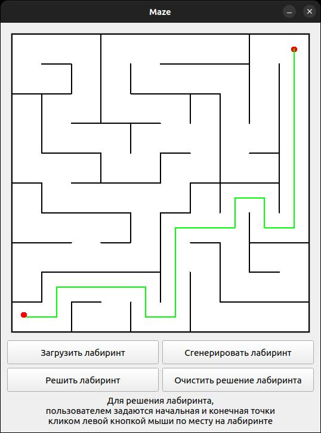

# Maze {#mainpage}

## Общее введение
Программа Maze позволяет генерировать и отрисовывать идеальные лабиринты.

## Программа предоставляет следующие возможности:
- В программе предусмотрена кнопка для загрузки лабиринта из файла.
    - Максимальный размер лабиринта - 50х50.
    - Загруженный лабиринт отрисован на экране в поле размером 500 x 500 пикселей.
    - Толщина "стены" - 2 пикселя.
    - Размер самих ячеек лабиринта вычисляется таким образом, чтобы лабиринт занимал всё отведенное под него поле.
- Автоматическая генерация идеального лабиринта.
    - Идеальным считается лабиринт, в котором из каждой точки можно попасть в любую другую точку ровно одним способом.
    - Пользователем вводится только размерность лабиринта: количество строк и столбцов.
    - Сгенерированный лабиринт сохраняется в файл.
- Решение любого лабиринта, который сейчас изображен на экране.
    - Пользователем задаются начальная и конечная точки кликом левой кнопкой мыши по месту на лабиринте.
    - Маршрут, являющийся решением, отображается линией толщиной 2 пикселя, проходящей через середины всех ячеек лабиринта, через которые пролегает решение.

## Сборка и установка программы
- make             - уснановить в директорию bin и запустить программу
- make install     - установка программы в директорию bin
- make uninstall   - удалить программу
- make clean       - очистить директорию от мусора
- make dist        - создать архив программы в директории bin
- make tests       - выполнить тесты
- make gcov_report - отчет покрытии тестами
- make dvi         - отчет проекта

## Зависимости
- Qt5
- qmake
- make
